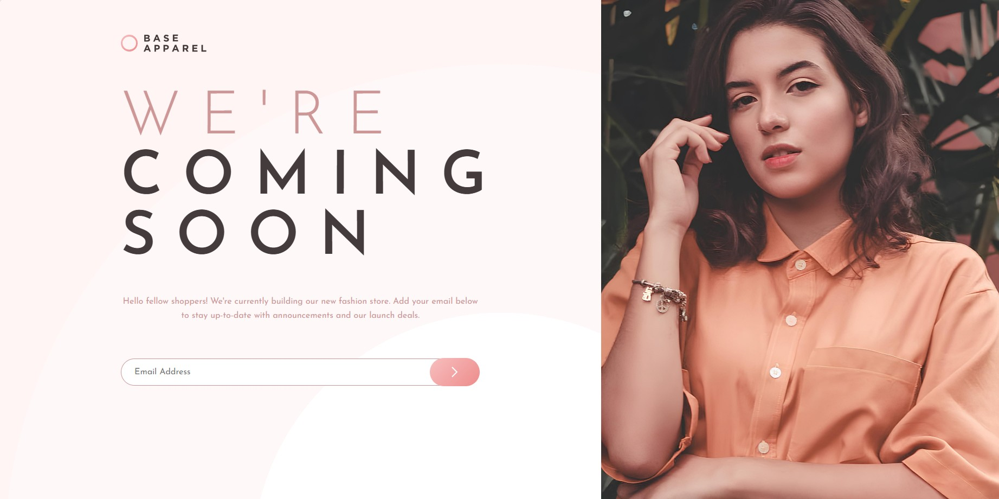
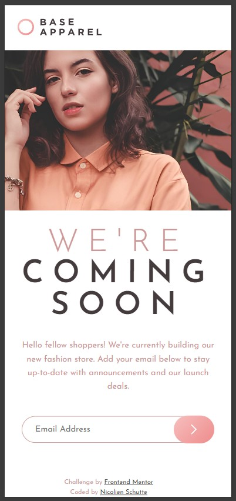

# Frontend Mentor - Base Apparel coming soon page solution

This is a solution to the [Base Apparel coming soon page challenge on Frontend Mentor](https://www.frontendmentor.io/challenges/base-apparel-coming-soon-page-5d46b47f8db8a7063f9331a0). Frontend Mentor challenges help you improve your coding skills by building realistic projects. 

## Table of contents

- [Frontend Mentor - Base Apparel coming soon page solution](#frontend-mentor---base-apparel-coming-soon-page-solution)
  - [Table of contents](#table-of-contents)
  - [Overview](#overview)
    - [The challenge](#the-challenge)
    - [Screenshot](#screenshot)
    - [Links](#links)
  - [My process](#my-process)
    - [Built with](#built-with)
    - [What I learned](#what-i-learned)
    - [Continued development](#continued-development)
    - [Useful resources](#useful-resources)
  - [Author](#author)
  - [Acknowledgments](#acknowledgments)

## Overview

### The challenge

Users should be able to:

- View the optimal layout for the site depending on their device's screen size
- See hover states for all interactive elements on the page
- Receive an error message when the `form` is submitted if:
  - The `input` field is empty
  - The email address is not formatted correctly

### Screenshot

### Links

- Solution URL: [Add solution URL here](https://github.com/NicolienSchutte/FrontEndChallenges/tree/main/src/challenges/base_apparel_coming_soon)
- Live Site URL: [Add live site URL here](https://fem-nicolienschutte.pages.dev/src/challenges/base_apparel_coming_soon/)

## My process

### Built with

  - Semantic HTML5 markup
  - CSS custom properties (variables)
  - CSS Grid for layout
  - Flexbox for form alignment
  - Mobile-first workflow
  - Vanilla JavaScript for form validation

### What I learned

This project helped me practice structuring a responsive layout with CSS Grid and refining it at breakpoints. One of my biggest learnings was handling form validation and error styling in a way that is accessible and matches the design.

I also experimented with CSS variables for background images and found it useful to switch between mobile and desktop assets at different breakpoints.

:root {
  --hero-image: url("../assets/images/hero-mobile.jpg");
}

@media (min-width: 1440px) {
  :root {
    --hero-image: url("../assets/images/hero-desktop.jpg");
  }
}

.hero {
  background-image: var(--hero-image);
  background-size: cover;
  background-position: top center;
}

For the form, I wrapped the input in a relative container and positioned the error icon absolutely:

.input-wrapper {
  position: relative;
  flex: 1;
}

.error-icon {
  position: absolute;
  right: 1rem;
  top: 50%;
  transform: translateY(-50%);
  display: none;
}

### Continued development

In future projects I’d like to:

  - Explore more advanced responsive image handling (using <picture> and srcset).
  - Improve form validation with more user-friendly success/error states.
  - Practice using accessibility-first techniques, like ARIA attributes and better keyboard navigation.

### Useful resources

- [MDN Web Docs - Using CSS Grid](https://developer.mozilla.org/en-US/docs/Web/CSS/CSS_grid_layout) - Helped me structure the responsive layout cleanly.
- [CSS-Tricks - A Complete Guide to Flexbox](https://css-tricks.com/snippets/css/a-guide-to-flexbox/) – Essential reference for aligning the input, error icon, and button.

## Author

- Website - [Nicolien Schutte](https://fem-nicolienschutte.pages.dev/)
- Frontend Mentor - [@NicolienSchutte](https://www.frontendmentor.io/profile/NicolienSchutte)

## Acknowledgments

Thanks to the Frontend Mentor community for the challenge and inspiration. Special thanks to resources on MDN and CSS-Tricks for clear explanations that made tricky parts like form styling and grid alignment easier.
