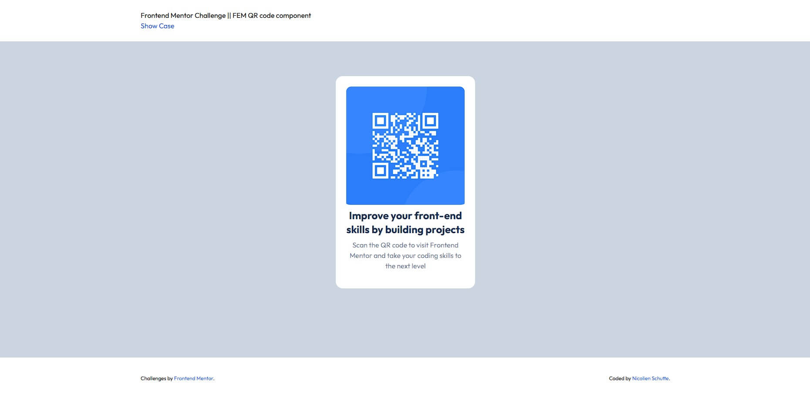
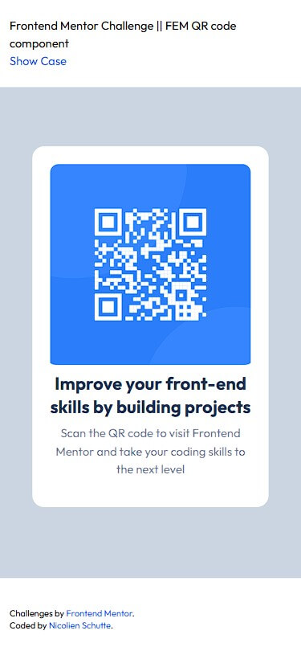

# Frontend Mentor - QR code component solution

This is a solution to the [QR code component challenge on Frontend Mentor](https://www.frontendmentor.io/challenges/qr-code-component-iux_sIO_H). Frontend Mentor challenges help you improve your coding skills by building realistic projects. 

## Table of contents

- [Frontend Mentor - QR code component solution](#frontend-mentor---qr-code-component-solution)
  - [Table of contents](#table-of-contents)
  - [Overview](#overview)
    - [Screenshot](#screenshot)
    - [Links](#links)
  - [My process](#my-process)
    - [Built with](#built-with)
    - [What I learned](#what-i-learned)
    - [Useful resources](#useful-resources)
  - [Author](#author)
  - [Acknowledgments](#acknowledgments)

## Overview

### Screenshot

### Links

- Solution URL: [Live Site](https://6bed4e8c.fem-qr-code-component-8ie.pages.dev/)
- GitHub Repository: [Repo](https://github.com/NicolienSchutte/FEM-QR-Code-Component.git)

## My process

### Built with

- Semantic HTML5 markup
- Mobile-first workflow
- [TailwindCSS](https://reactjs.org/) - Tailwind Framework for styling
- [Node js](https://nodejs.org/en) - Node JS

### What I learned

Using the tailwindcss framework to handle the styling of the webpage.

- [Customizing configuration file](https://tailwindcss.com/docs/configuration)
- [Using Grid with the tailwind framework](https://tailwindcss.com/docs/grid-template-columns)

### Useful resources

- [Tailwindcss Documentation](https://tailwindcss.com/docs/installation) - This helped me with getting familiar with the framework.

## Author

- Frontend Mentor - [@NicolienSchutte](https://www.frontendmentor.io/profile/NicolienSchutte)

## Acknowledgments

Tailwindcss for making it so easy to understand their documentation and use the framework.
