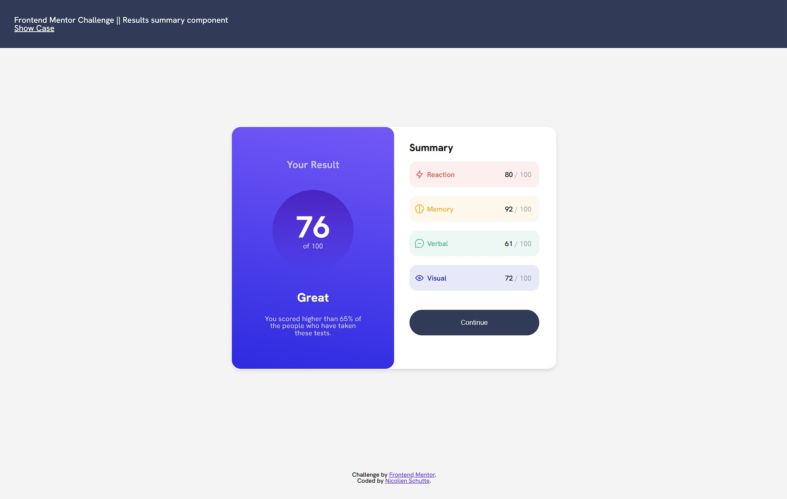
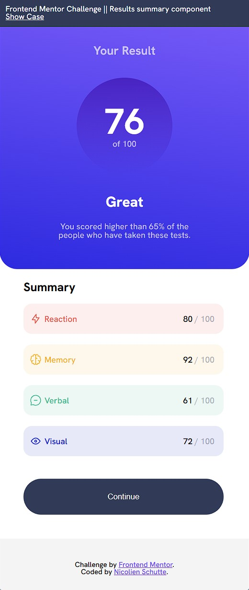

# Frontend Mentor - Stats preview card component solution
This is a solution to the [Stats preview card component challenge on Frontend Mentor](https://www.frontendmentor.io/challenges/stats-preview-card-component-8JqbgoU62). Frontend Mentor challenges help you improve your coding skills by building realistic projects. 

## Table of contents
- [Frontend Mentor - Stats preview card component solution](#frontend-mentor---stats-preview-card-component-solution)
  - [Table of contents](#table-of-contents)
  - [Overview](#overview)
    - [The challenge](#the-challenge)
    - [Screenshot](#screenshot)
    - [Links](#links)
  - [My process](#my-process)
    - [Built with](#built-with)
    - [Useful resources](#useful-resources)
  - [Author](#author)

## Overview

### The challenge
Users should be able to:

- View the optimal layout for the interface depending on their device's screen size
- See hover and focus states for all interactive elements on the page
- **Bonus**: Use the local JSON data to dynamically populate the content

### Screenshot

### Links

- Solution URL: [Live Site](https://fem-nicolienschutte.pages.dev/src/challenges/results_summary_component/)
- GitHub Repository: [Repo](https://github.com/NicolienSchutte/FrontEndChallenges/tree/main/src/challenges/results_summary_component)
  

## My process

### Built with
- Semantic HTML5 markup 
- CSS custom properties
- Flexbox
- Mobile-first workflow
- Vanilla HTML, CSS, and JavaScript
- Responsive design using media queries
- Dynamic content generation with JavaScript
- Fetching and manipulating JSON data

### Useful resources
- [CSS Tools: Reset CSS](http://meyerweb.com/eric/tools/css/reset/) - This is a excellent reset biolerplate for CSS
- [W3Schools](https://www.w3schools.com) - W3Schools is a valuable resource for quick references.
  

## Author
- Frontend Mentor - [@NicolienSchutte](https://www.frontendmentor.io/profile/NicolienSchutte)

